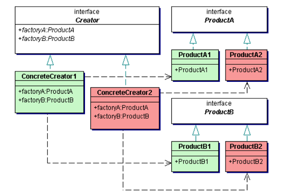

# 抽象工厂模式

抽象工厂模式是所有形态的工厂模式中最为抽象和最具一般性的一种形态。抽象工厂模式是指当有多个抽象角色时，使用的一种工厂模式。抽象工厂模式
可以向客户端提供一个接口，使客户端在不必指定产品的具体的情况下，创建多个产品族中的产品对象。根据里氏替换原则，任何接受父类型的地方，都应
当能够接受子类型。因此，实际上系统所需要的，仅仅是类型与这些抽象产品角色相同的一些实例，而不是这些抽象产品的实例。换言之，也就是这些抽象
产品的具体子类的实例。工厂类负责创建抽象产品的具体子类的实例。

# 优点

1. 分离了子类。
2. 易于交换产品系列。
3. 利于产品一致性。

# 缺点

1. 难以支持新种类的产品。
